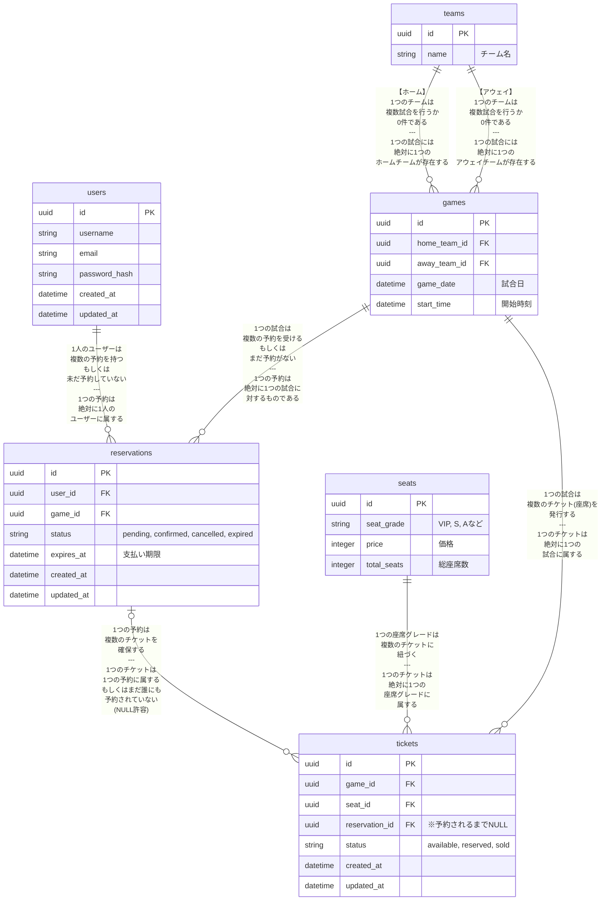

```mermaid
erDiagram
    users ||--o{ reservations : "1人のユーザーは<br>複数の予約を持つ<br>もしくは<br>未だ予約していない<br>---<br>1つの予約は<br>絶対に1人の<br>ユーザーに属する"

    games ||--o{ reservations : "1つの試合は<br>複数の予約を受ける<br>もしくは<br>まだ予約がない<br>---<br>1つの予約は<br>絶対に1つの試合に<br>対するものである"

    teams ||--o{ games : "【ホーム】<br>1つのチームは<br>複数試合を行うか<br>0件である<br>---<br>1つの試合には<br>絶対に1つの<br>ホームチームが存在する"

    teams ||--o{ games : "【アウェイ】<br>1つのチームは<br>複数試合を行うか<br>0件である<br>---<br>1つの試合には<br>絶対に1つの<br>アウェイチームが存在する"

    games ||--o{ tickets : "1つの試合は<br>複数のチケット(座席)を<br>発行する<br>---<br>1つのチケットは<br>絶対に1つの<br>試合に属する"

    seats ||--o{ tickets : "1つの座席グレードは<br>複数のチケットに<br>紐づく<br>---<br>1つのチケットは<br>絶対に1つの<br>座席グレードに<br>属する"

    reservations |o--o{ tickets : "1つの予約は<br>複数のチケットを<br>確保する<br>---<br>1つのチケットは<br>1つの予約に属する<br>もしくはまだ誰にも<br>予約されていない<br>(NULL許容)"

    users {
        uuid id PK
        string username
        string email
        string password_hash
        datetime created_at
        datetime updated_at
    }

    teams {
        uuid id PK
        string name "チーム名"
    }

    games {
        uuid id PK
        uuid home_team_id FK
        uuid away_team_id FK
        datetime game_date "試合日"
        datetime start_time "開始時刻"
    }

    seats {
        uuid id PK
        string seat_grade "VIP, S, Aなど"
        integer price "価格"
        integer total_seats "総座席数"
    }

    reservations {
        uuid id PK
        uuid user_id FK
        uuid game_id FK
        string status "pending, confirmed, cancelled, expired"
        datetime expires_at "支払い期限"
        datetime created_at
        datetime updated_at
    }

    tickets {
        uuid id PK
        uuid game_id FK
        uuid seat_id FK
        uuid reservation_id FK "※予約されるまでNULL"
        string status "available, reserved, sold"
        datetime created_at
        datetime updated_at
    }
```
